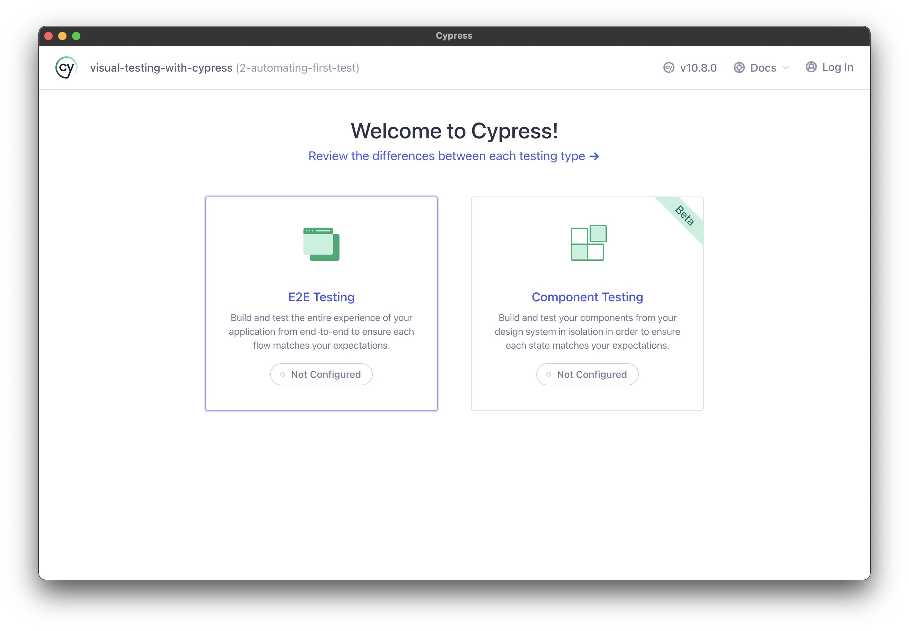
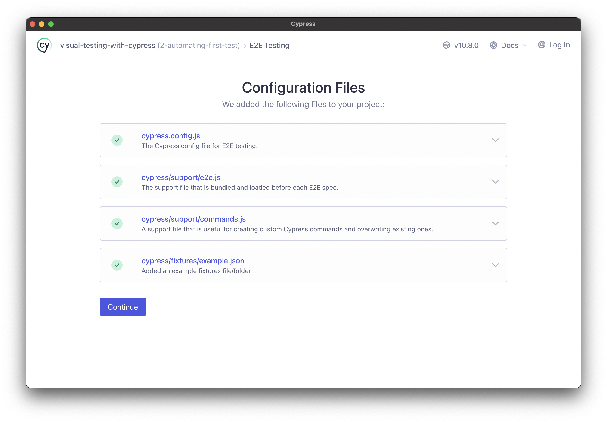
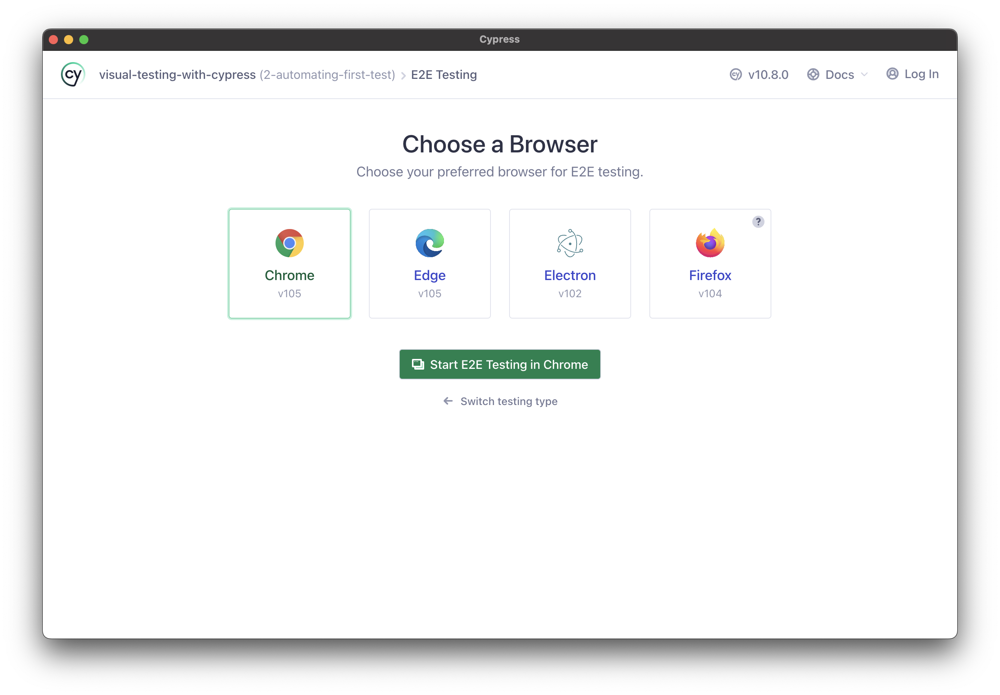
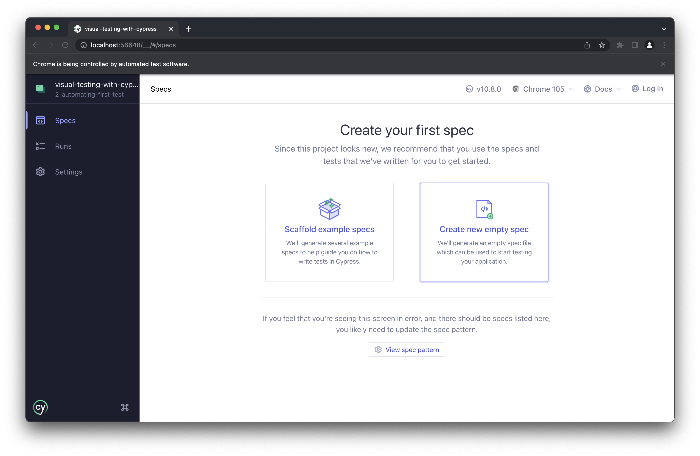
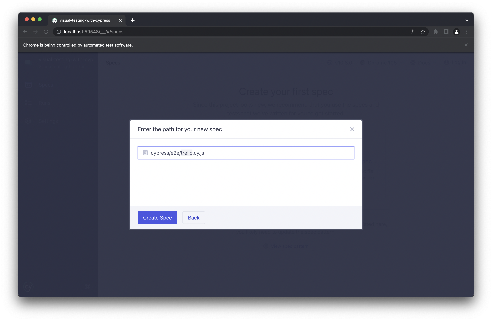
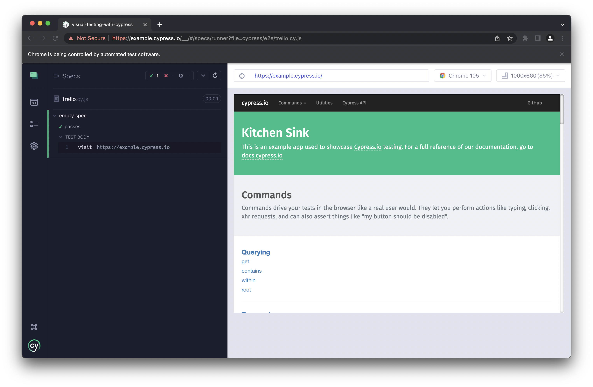

# Automating our first Cypress test

Now that we have our Trello clone app installed, let's start testing it!
In this chapter, we will automate a "traditional" UI test with Cypress.
We will enhance it in the next chapter with visual assertions.


## Formulating our test

Our first test will be short and sweet: we will test the creation of a new board for organizing tasks.

Step #1 is to load the home page:


Step #2 is to verify that the home page loaded correctly.
We can't check *everything* on this page, but we can make sure that key elements appear:

* the app title
* the login button
* the "Get Started!" message
* the input field for the board name
* the artful image


Step #3 is to create a new board.
Let's call this board "House Chores".
Type this name into the input field and hit ENTER:


Finally, Step #4 is to verify that the new board is created correctly.
Again, we can't check everything, but we should verify the following:

* the title bar has the home button
* the board name is "House Chores"
* there is one column with an input for a new list


Try running these steps manually to become familiar with the app behaviors.


## Creating a new test project

For this tutorial, we will create a new, separate project for our Cypress tests.
This project must be *separate* from the Trello clone app's repository.

Create a new project folder:

```
mkdir visual-testing-with-cypress
cd visual-testing-with-cypress
```

Set up the project with a `package.json` file by running:

```
npm init
```

Answer the prompts as you see fit.
You can take default values.

To install Cypress, run:

```
npm install -D cypress
```

*Note:*
The example code in this project uses Cypress 10.8.0.
Later versions of Cypress should work,
but some of the fine details might be differe.

Next, we need to set up the Cypress project files.
The easiest way to do this is through the Cypress window.
Run the following command to get started:

```
npx cypress open
```

When the Cypress window opens, chose "E2E Testing":



Then, Cypress will generate a set of folders and files for running tests.
Accept them by clicking "Continue":



The next screen will prompt you for a browser to use for testing.
Pick whichever one you like:



The following screen will invite you create your first spec.
Choose "Create new empty spec":



Set the name of the new file to `cypress/e2e/trello.cy.js`:



When prompted, choose to run your new spec.
The only thing the new test does is load the [Cypress example page](https://example.cypress.io).
The test should pass:



At this point, close the window.
The Cypress project should be all set up!
Your project directory should look like this:

```
visual-testing-with-cypress
├── cypress
│   ├── e2e
│   │   └── trello.cy.js
│   ├── fixtures
│   │   └── example.json
│   └── support
│       ├── commands.js
│       └── e2e.js
├── cypress.config.js
├── package-lock.json
└── package.json
```


## Automating test steps

TBD


## Running the test

TBD
