# Automating our first Cypress test

Now that we have our Trello clone app installed, let's start testing it!
In this chapter, we will automate a "traditional" UI test with Cypress.
We will enhance it in the next chapter with visual assertions.


## Creating a new test project

For this tutorial, we will create a new, separate project for our Cypress tests.
This project must be *separate* from the Trello clone app's repository.

Create a new project folder:

```
mkdir visual-testing-with-cypress
cd visual-testing-with-cypress
```

Set up the project with a `package.json` file by running:

```
npm init
```

Answer the prompts as you see fit.
You can take default values.

To install Cypress, run:

```
npm install -D cypress
```

*Note:*
The example code in this project uses Cypress 10.8.0.
Later versions of Cypress should work,
but some of the fine details might be different.

Next, we need to set up the Cypress project files.
The easiest way to do this is through the Cypress window.
Run the following command to get started:

```
npx cypress open
```

When the Cypress window opens, chose "E2E Testing":

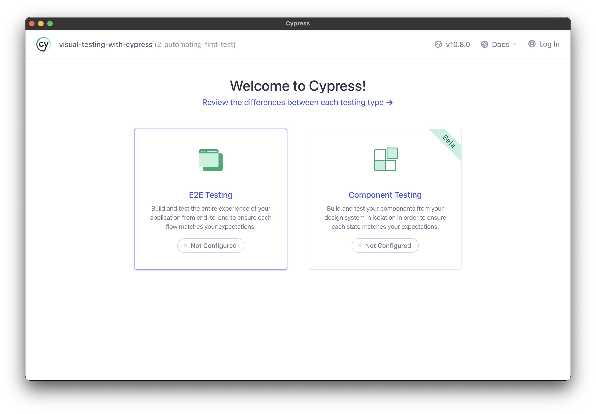

Then, Cypress will generate a set of folders and files for running tests.
Accept them by clicking "Continue":

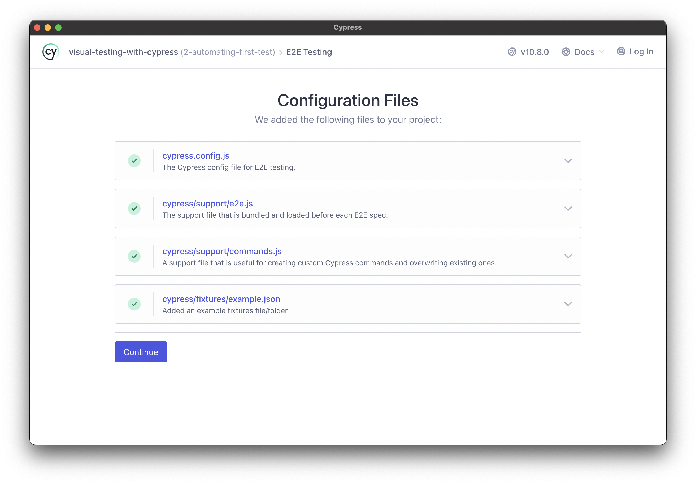

The next screen will prompt you for a browser to use for testing.
Pick whichever one you like:

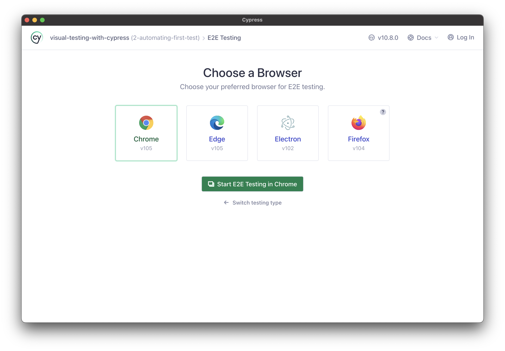

The following screen will invite you create your first spec.
Choose "Create new empty spec":

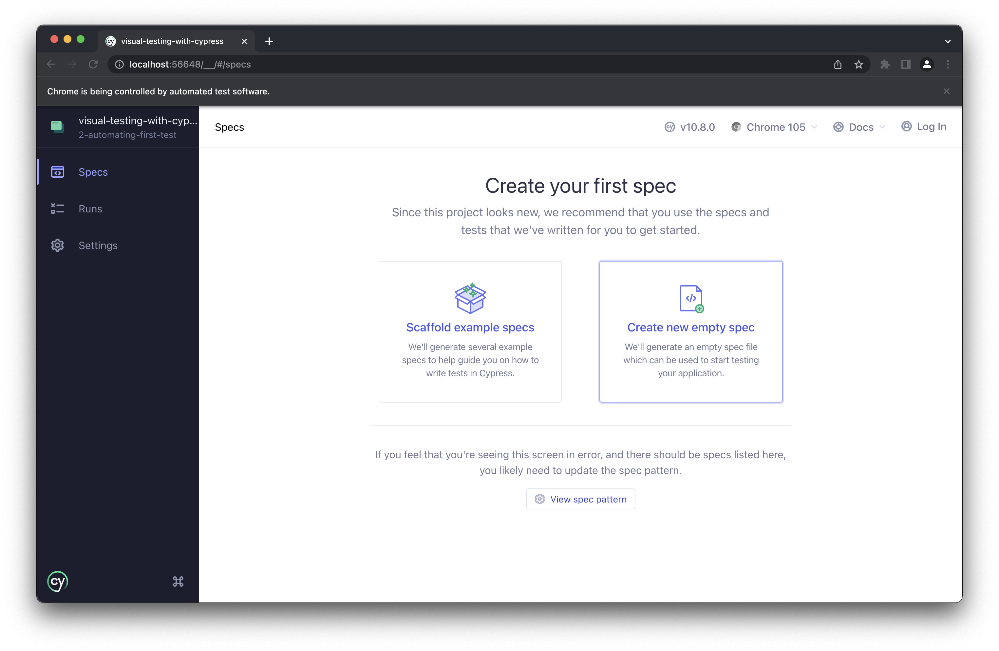

Set the name of the new file to `cypress/e2e/trello.cy.js`:

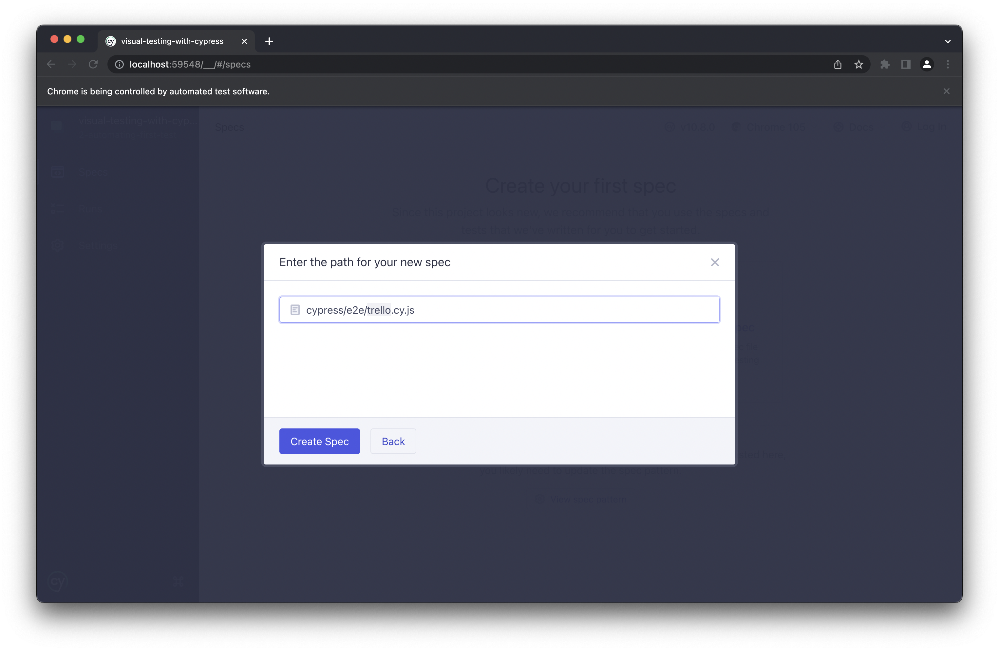

When prompted, choose to run your new spec.
The only thing the new test does is load the [Cypress example page](https://example.cypress.io).
The test should pass:

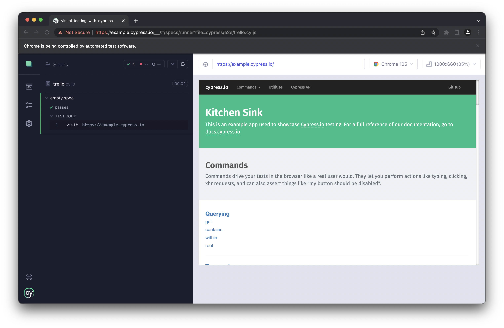

At this point, close the window.
The Cypress project should be all set up!
Your project directory should look like this:

```
visual-testing-with-cypress
├── cypress
│   ├── e2e
│   │   └── trello.cy.js
│   ├── fixtures
│   │   └── example.json
│   └── support
│       ├── commands.js
│       └── e2e.js
├── cypress.config.js
├── package-lock.json
└── package.json
```


## Formulating our test

Our first test will be short and sweet: we will test the creation of a new board for organizing tasks.

Step #1 is to load the home page:


Step #2 is to verify that the home page loaded correctly.
We can't check *everything* on this page, but we can make sure that key elements appear:

* the app title
* the login button
* the input field for the board name
* the artful image
* the "Get Started!" message

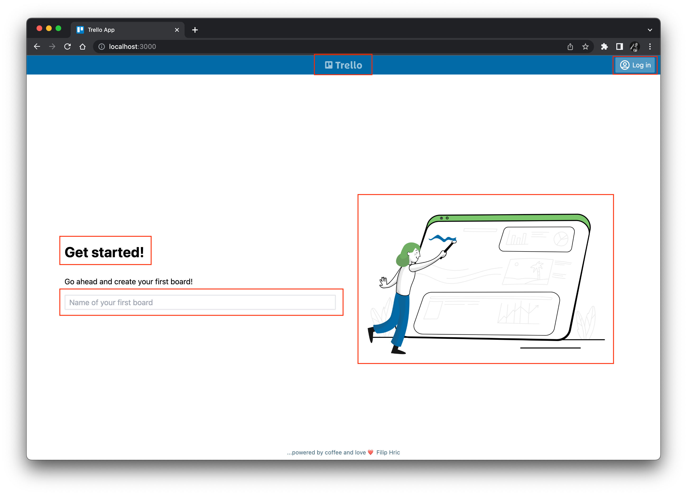

Step #3 is to create a new board.
Let's call this board "House Chores".
Type this name into the input field and hit ENTER:

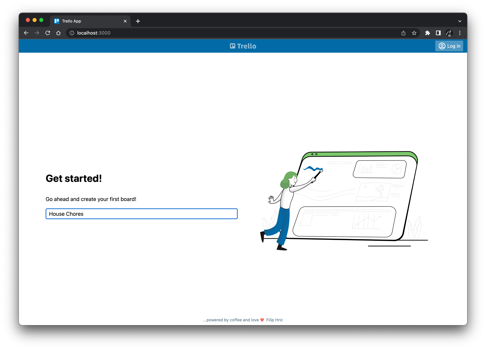

Finally, Step #4 is to verify that the new board is created correctly.
Again, we can't check everything, but we should verify the following:

* the title bar has the home button
* the board name is "House Chores"
* there is one column with an input for a new list

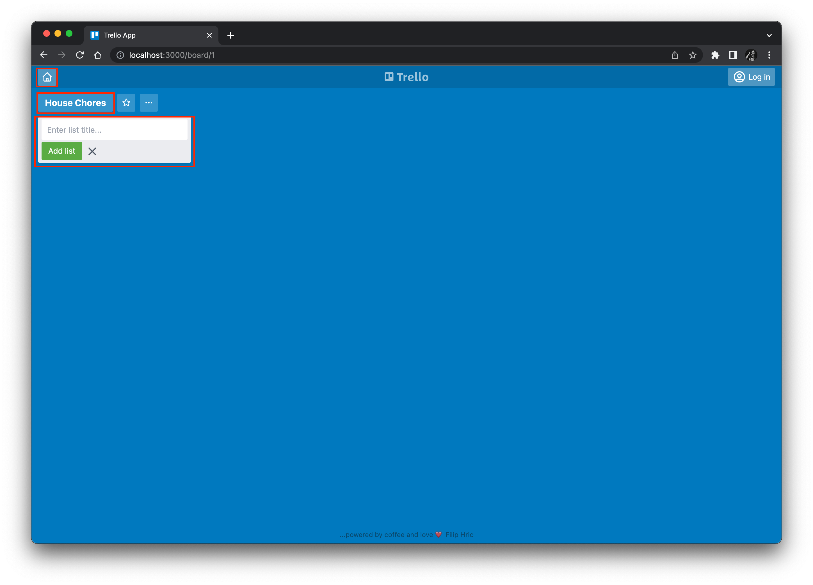

Try running these steps manually to become familiar with the app behaviors.


## Automating test steps

Since the app under test is running on your local machine,
we can set its base URL in the Cypress configuration so that the automation code can use shorter resource paths.
Open `cypress.config.js` and add the following `baseUrl` setting:

```javascript
module.exports = defineConfig({
  e2e: {
    // ...
    baseUrl: 'http://localhost:3000',
    // ...
  },
});
```

Now, let's write the automation code.
Open the `cypress/e2e/trello.cy.js` file, and delete all its content.
Replace it with the following test stub:

```javascript
describe('Trello', () => {

  beforeEach(() => {
    // Reset app data
  })

  it('can create a new board', () => {
    // Load the home page
    // Verify the home page loaded
    // Create a new board
    // Verify the new board is created
  })
})
```

Before each test, we need to reset the app data.
Anything one test creates or deletes should not affect other tests.
There are many different strategies for managing test data,
but for this tutorial, we will start each test with a "blank slate" – with no data in the system.
Add the following code to the `beforeEach` method:

```javascript
  beforeEach(() => {
    // Reset app data
    cy.request('POST', '/api/reset')
  })
```

*Note:*
If you want to learn more about test data management strategies, watch this talk on YouTube:
[Managing the Test Data Nightmare](https://www.youtube.com/watch?v=6DQhfjq_HSI)
by [Andrew Knight](https://twitter.com/AutomationPanda).

We will add test case steps inside the `it('can create a new board'` test function.
For step 1, add the following code to load the home page:

```javascript
    // Load the home page
    cy.visit('/')
```

Since the Cypress config has the base URL, we only need `'/'` to navigate to the app's home page.

Step 2 must verify that 5 key elements appear on the home page.
Add the following code: 

```javascript
    // Verify the home page loaded
    cy.get('[data-cy="trello-logo"]').should('be.visible')
    cy.get('[data-cy="login-menu"]').should('be.visible')
    cy.get('[data-cy="first-board"]').should('be.visible')
    cy.get('img[src*="start"]').should('be.visible')
    cy.contains('Get started!').should('be.visible')
```

These calls merely verify that these elements appear somewhere on the page.
The last line verifies the text of that element, too.

*Note:*
If you want to learn more about web element locators,
it is recommended to take the 
[Web Element Locator Strategies](https://testautomationu.applitools.com/web-element-locator-strategies/)
course from Test Automation University.

Step 3 creates a new board by locating the input field, typing the board name, and hitting the ENTER key.
Add the following code:

```javascript
    // Create a new board
    cy.get('[data-cy="first-board"]').type('House Chores{enter}')
```

Step 4 performs more verifications.
Not only should it verify that home button, board title, and list input appear,
but since the board is new, it must also make sure that no other lists appear.
Add the following code to finish the test:

```javascript
    // Verify the new board is created
    cy.get('[data-cy="home"]').should('be.visible')
    cy.get('[data-cy="board-title"]').should('have.value', 'House Chores')
    cy.get('[data-cy="add-list-input"]').should('have.length', 1)
    cy.get('[data-cy="list-name"]').should('have.length', 0)
```

The full code for `trello.cy.js` should look like this:

```javascript
describe('Trello', () => {

  beforeEach(() => {
    // Reset app data
    cy.request('POST', '/api/reset')
  })

  it('can create a new board', () => {
    // Load the home page
    cy.visit('/')

    // Verify the home page loaded
    cy.get('[data-cy="trello-logo"]').should('be.visible')
    cy.get('[data-cy="login-menu"]').should('be.visible')
    cy.get('[data-cy="first-board"]').should('be.visible')
    cy.get('img[src*="start"]').should('be.visible')
    cy.contains('Get started!').should('be.visible')

    // Create a new board
    cy.get('[data-cy="first-board"]').type('House Chores{enter}')

    // Verify the new board is created
    cy.get('[data-cy="home"]').should('be.visible')
    cy.get('[data-cy="board-title"]').should('have.value', 'House Chores')
    cy.get('[data-cy="add-list-input"]').should('have.length', 1)
    cy.get('[data-cy="list-name"]').should('have.length', 0)
  })
})
```

*Note:*
If you want to learn more about Cypress,
it is recommended to take the following Test Automation University courses:

* [Introduction to Cypress](https://testautomationu.applitools.com/cypress-tutorial/)
* [Advanced Cypress](https://testautomationu.applitools.com/advanced-cypress-tutorial/)


## Running the test

Before running tests, make sure the Trello clone app is running.
If it's not running, run `npm start` from the `trelloapp-vue-vite-ts` project
as shown in the [previous chapter](1-setting-up-app.md).

Let's run our new test from the Cypress window.
Run the following command in a separate terminal to launch the window:

```
npx cypress open
```

On the first screen, select "E2E Testing" and then the browser of your choice.
The test window will appear:

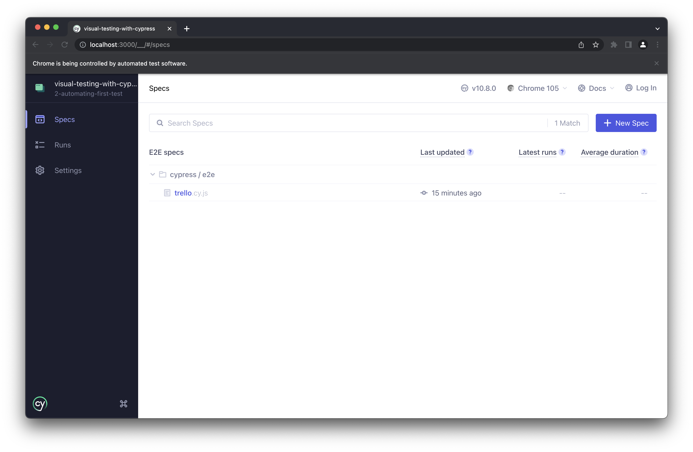

Select `trello.cy.js` to run it.
Cypress will show every single line as it runs with its success or failure:

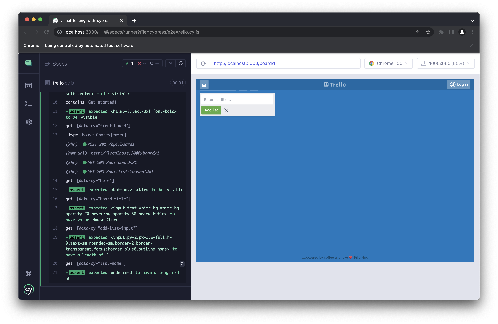

Make sure the test passes.
Congrats! You've finished the first test.

Running tests from the Cypress window is ideal while developing the app and the tests.
You can click any test to run (or rerun) it.

On the other hand, if you want to run tests from a Continuous Integration (CI) server,
it's better to run Cypress tests from the command line, like this:

```
npx cypress run
```

By default, this command runs tests using Electron.
To explicitly set the browser, use the `--browser` option, like this:

```
npx cypress run --browser chrome
npx cypress run --browser edge
npx cypress run --browser firefox
```