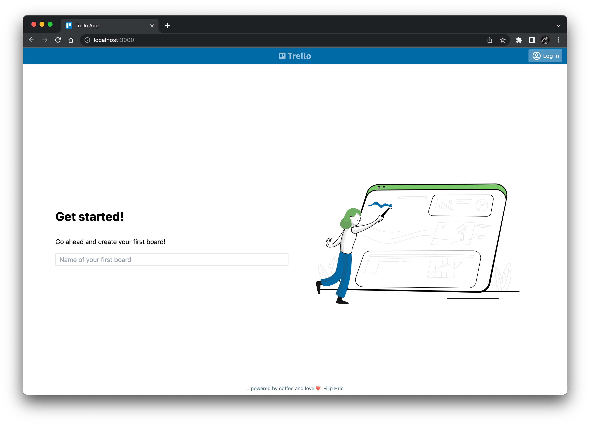
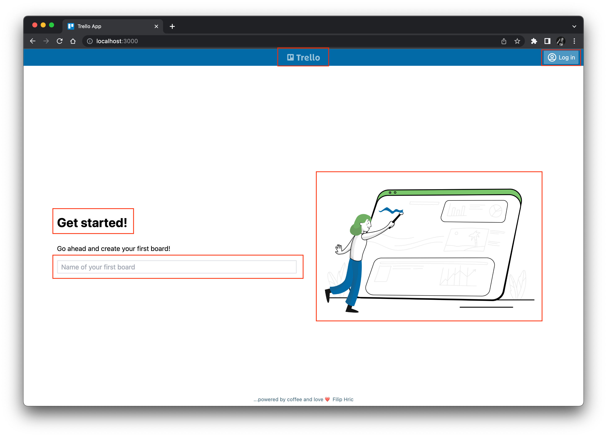
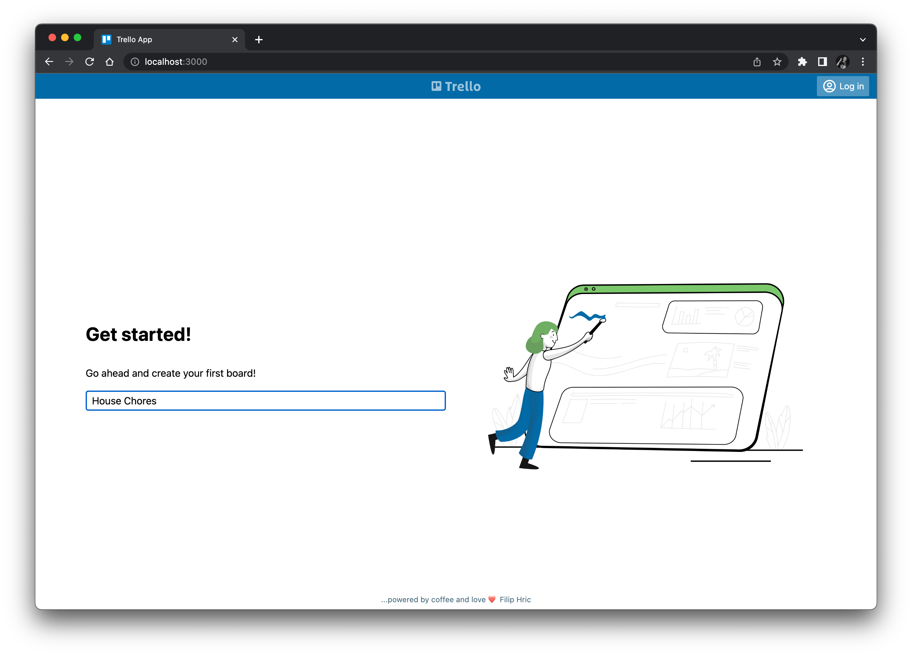
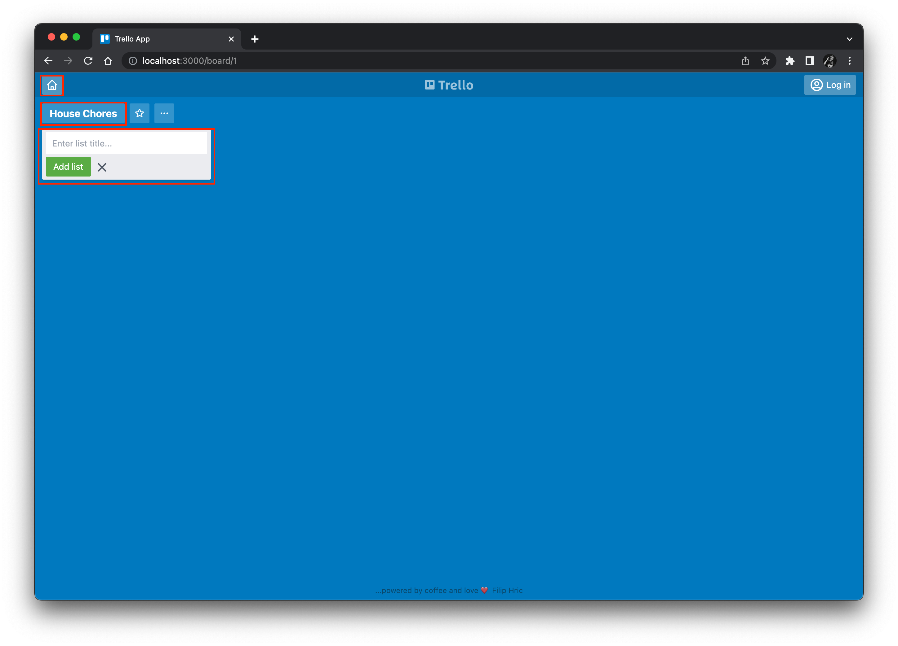

# Automating our first Cypress test

Now that we have our Trello clone app installed, let's start testing it!
In this chapter, we will automate a "traditional" UI test with Cypress.
We will enhance it in the next chapter with visual assertions.


## Formulating our test

Our first test will be short and sweet: we will test the creation of a new board for organizing tasks.

Step #1 is to load the home page:



Step #2 is to verify that the home page loaded correctly.
We can't check *everything* on this page, but we can make sure that key elements appear:

* the app title
* the login button
* the "Get Started!" message
* the input field for the board name
* the artful image



Step #3 is to create a new board.
Let's call this board "House Chores".
Type this name into the input field and hit ENTER:



Finally, Step #4 is to verify that the new board is created correctly.
Again, we can't check everything, but we should verify the following:

* the title bar has the home button
* the board name is "House Chores"
* there is one column with an input for a new list



Try running these steps manually to become familiar with the app behaviors.


## Installing Cypress

To install Cypress, run:

```
npm install -D cypress
```

*Note:*
The example code in this project uses Cypress 10.8.0.
Later versions of Cypress should also work.


## Automating test steps

TBD


## Running the test

TBD
