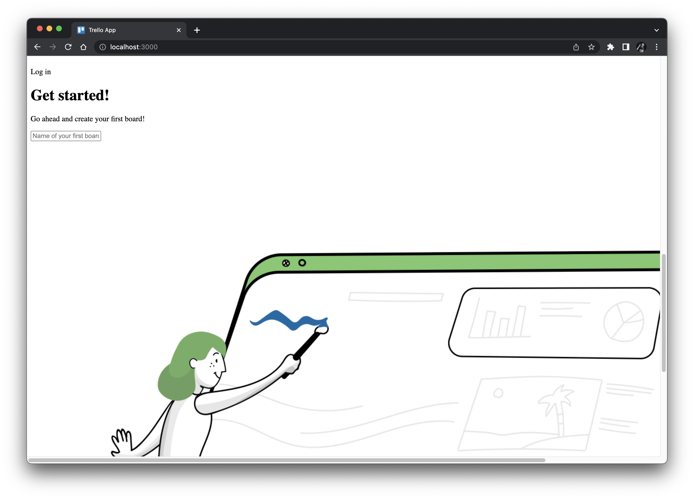

# Rewriting our test with visual assertions

Our test is good, but it has some serious test gaps.
In this chapter, let's cover those gaps by adding assertions to check visual aspects of the app's pages.


## Learning how visual testing works

Let's revisit step 2, in which our test verifies that the home page loaded correctly.
The Cypress automation code checks that five elements are visible on the page:

```javascript
cy.get('[data-cy="trello-logo"]').should('be.visible')
cy.get('[data-cy="login-menu"]').should('be.visible')
cy.get('[data-cy="first-board"]').should('be.visible')
cy.get('img[src*="start"]').should('be.visible')
cy.contains('Get started!').should('be.visible')
```

Those five elements are depicted below:


Visibility alone is a weak assertion.
The test will pass as long as the elements appear somewhere on the page.
These assertions do not check:

* any of the other elements
* layout
* location
* position
* size
* color
* text

In fact, the test would pass even if *all* styling is removed from the page:



Unfortunately, checking visuals is difficult with traditional assertions.
We could add code to broaden coverage for text values and other elements,
but that takes more development time and potentially makes the test more fragile.
Other aspects like position and color are arguably impossible.
We could write very specific code to check HTML structure and CSS styling,
but that won't necessarily verify that the user sees what is intended.

Visual testing techniques can help us here.
We can take a visual snapshot to capture everything on this page.
Then, whenever we run this test,
we can take a new snapshot ("checkpoint") and compare it to the original ("baseline"):

* If the images are *the same*, then the assertion will pass.
* If the images are *different*, the test will alert us to investigate:
  * We can *accept* the checkpoint as a new baseline if the change is good.
  * Or, we can *reject* the checkpoint and fail the test if the change is bad.

In this tutorial, we will use [Applitools](https://applitools.com/) as our visual testing tool.
Applitools does more than just pixel-to-pixel comparisons:
It uses [Visual AI](https://applitools.com/visual-ai-and-deep-learning/) backed by deep learning
to evaluate images as if they were human eyes.
Small differences like pixel padding shifts or slight variations in font can be ignored.
Match levels can also filter aspects like layouts, text, colors, and shifted elements.
You can hone your visual assertions to provide meaningful feedback and avoid noisy false positives.
Applitools also provides several other features that we will explore as part of this tutorial.

Let's give this a try!


## Rewriting steps with visual assertions

To start, [register a free Applitools account](https://auth.applitools.com/users/register).

Then, install the Applitools Eyes SDK into your Cypress project:

```
npm install -D @applitools/eyes-cypress
```

*Note:*
The example code in this project uses `@applitools/eyes-cypress` ?.
Later versions should work as well.


## Running the updated tests

TBD
