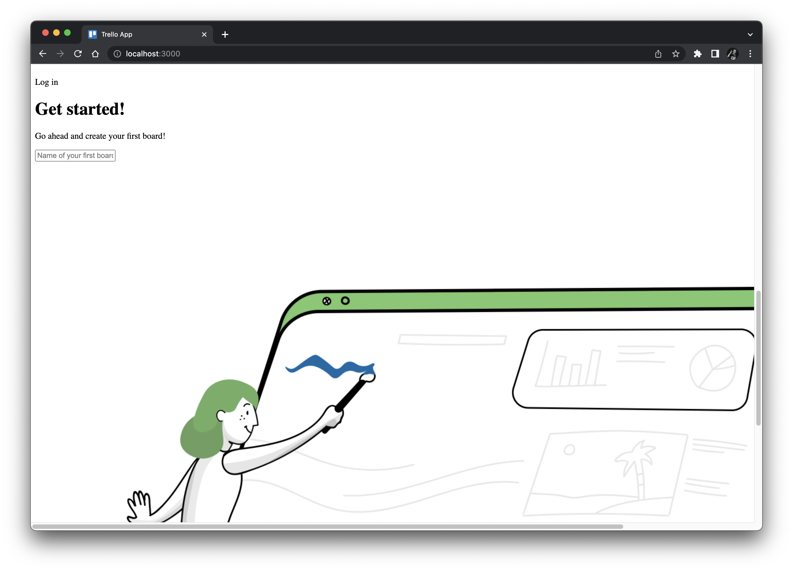
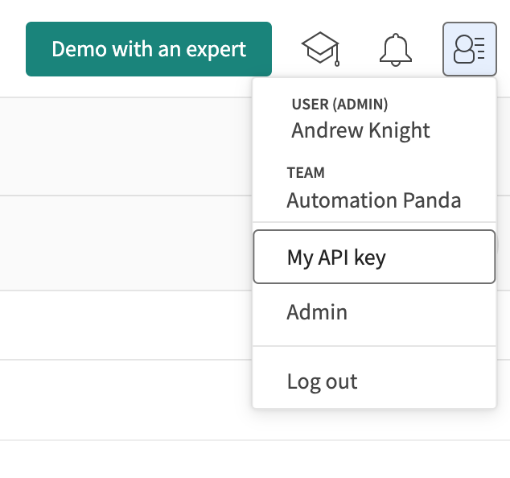
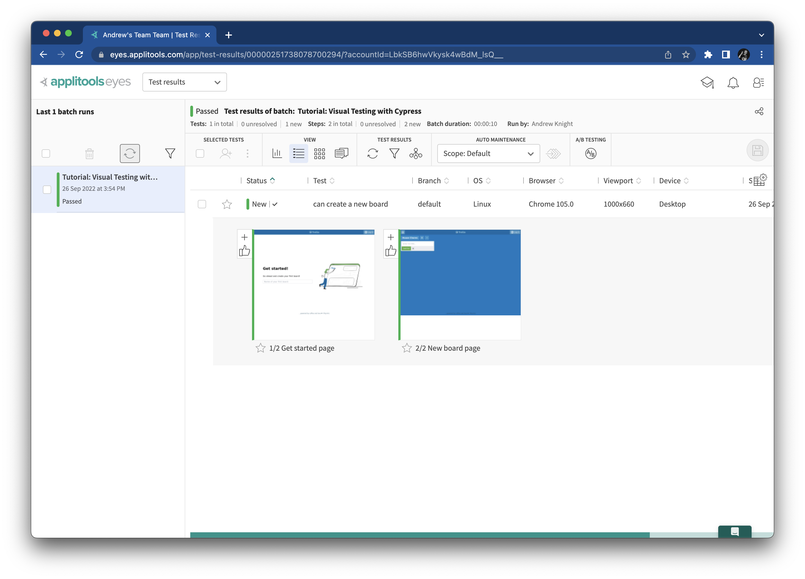
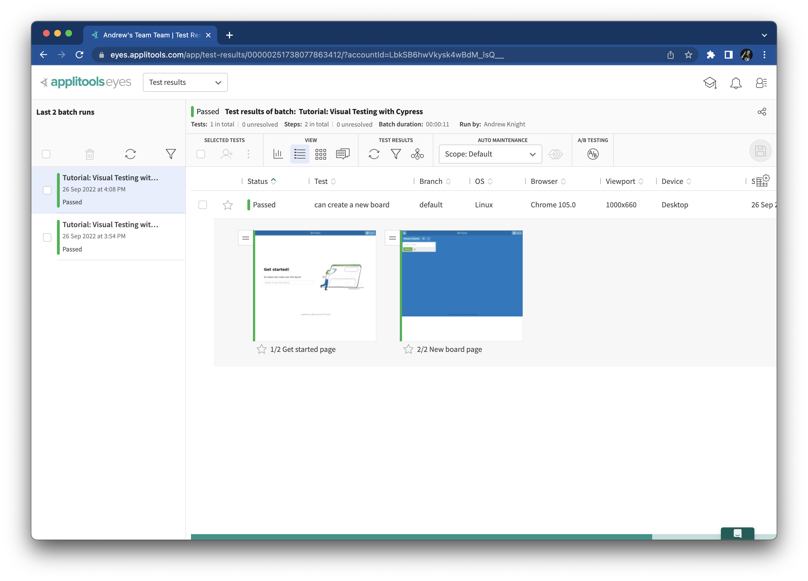
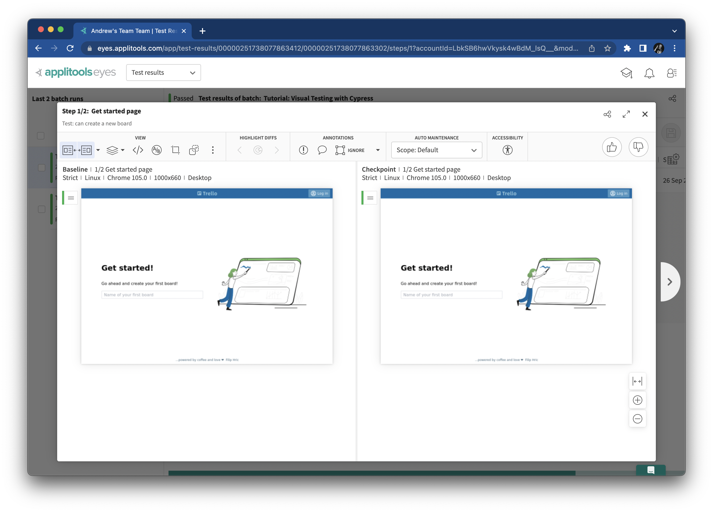

# Rewriting our test with visual assertions

Our test is good, but it has some serious test gaps.
In this chapter, let's cover those gaps by adding assertions to check visual aspects of the app's pages.


## Learning how visual testing works

Let's revisit step 2, in which our test verifies that the home page loaded correctly.
The Cypress automation code checks that five elements are visible on the page:

```javascript
cy.get('[data-cy="trello-logo"]').should('be.visible')
cy.get('[data-cy="login-menu"]').should('be.visible')
cy.get('[data-cy="first-board"]').should('be.visible')
cy.get('img[src*="start"]').should('be.visible')
cy.contains('Get started!').should('be.visible')
```

Those five elements are depicted below:


Visibility alone is a weak assertion.
The test will pass as long as the elements appear somewhere on the page.
These assertions do not check:

* any of the other elements
* layout
* location
* position
* size
* color
* text

In fact, the test would pass even if *all* styling is removed from the page:



Unfortunately, checking visuals is difficult with traditional assertions,
even if it is obvious to us as humans that the app is broken.
We could add code to broaden coverage for text values and other elements,
but that takes more development time and potentially makes the test more fragile.
Other aspects like position and color are arguably impossible.
We could write very specific code to check HTML structure and CSS styling,
but that won't necessarily verify that the user sees what is intended.

Visual testing techniques can help us here.
We can take a visual snapshot to capture everything on this page.
Then, whenever we run this test,
we can take a new snapshot ("checkpoint") and compare it to the original ("baseline"):

* If the images are *the same*, then the assertion will pass.
* If the images are *different*, the test will alert us to investigate:
  * We can *accept* the checkpoint as a new baseline if the change is good.
  * Or, we can *reject* the checkpoint and fail the test if the change is bad.

In this tutorial, we will use [Applitools](https://applitools.com/) as our visual testing tool.
Applitools does more than just pixel-to-pixel comparisons:
It uses [Visual AI](https://applitools.com/visual-ai-and-deep-learning/) backed by deep learning
to evaluate images as if they were human eyes.
Small differences like pixel padding shifts or slight variations in font can be ignored.
Match levels can also filter aspects like layouts, text, colors, and shifted elements.
You can hone your visual assertions to provide meaningful feedback and avoid noisy false positives.
Applitools also provides several other features that we will explore as part of this tutorial.

Let's give this a try!


## Adding Applitools to the Cypress project

To start, [register a free Applitools account](http://applitools.info/wzh).

Then, install the Applitools Eyes SDK into your Cypress project:

```
npm install -D @applitools/eyes-cypress
```

*Note:*
The example code in this project uses `@applitools/eyes-cypress` 3.27.1.
Later versions should work as well.

Next, we need to set up Applitools Eyes with the following setup command:

```
npx eyes-setup
```

Output for the setup command should look similar to this:

```
Setup eyes-cypress 3.27.1
Cypress version that was found ^10.8.0  (above v10 handler)
Plugins defined.
Commands defined.
Typescript defined.
Setup done!
```

We also need to add a special file to configure Applitools Eyes.
Create a new file in the root directory of the project named `applitools.config.js`,
and add the following contents:

```javascript
module.exports = {
    testConcurrency: 1,
    batchName: 'Tutorial: Visual Testing with Cypress',
}
```

Let's break down what those settings are:

* `testConcurrency` controls how many checkpoints Applitools will run in parallel.
  (If you have a free account, this number is limited to 1.)
* `batchName` is the name given to the batch of tests run at one time.
  It will be displayed in the Applitools Eyes dashboard.

Finally, we need to set our API key.
Every Applitools account has an API key for uploading results.
To find your API key, log into your Applitools account at [eyes.applitools.com](https://eyes.applitools.com/).
In the top-right corner of the dashboard, click the "User" icon,
and then from the dropdown menu select "My API key":



A modal will then appear showing your API key, which will be a very long alphanumeric string.
Copy the API key.
Then, add it to `applitools.config.js` like this:

```javascript
module.exports = {
  // ...
  apiKey: '<your-api-key>',
}
```

*Note:*
Instead of adding your API key to `applitools.config.js`,
you can set it as an environment variable named `APPLITOOLS_API_KEY`.
Using an environment variable is recommended for team projects with CI servers.
However, for this tutorial, we will use the Applitools config file for simplicity.


## Rewriting steps with visual assertions

Now, we are ready to rewrite our test steps with visual assertions!
All the code we need to update is in `cypress/e2e/trello.cy.js`.

To capture snapshots, we must "open" and "close" Applitools Eyes before and after each test.
Add the following code to the bottom of the `beforeEach` method to open Eyes:

```javascript
    // Open Eyes to start visual testing.
    cy.eyesOpen({
      appName: 'ACME Bank',                       // The name of the app under test
      testName: Cypress.currentTest.title,        // The name of the test case
    })
```

When opening Eyes, we provide the app name and the test name for reporting purposes.
The test name will be set to the name of the currently running Cypress test.

To close eyes, add the following `afterEach` method after the `beforeEach` method:

```javascript
  afterEach(() => {
    // Close Eyes to tell the server it should display the results.
    cy.eyesClose()
  })
```

Now, we can update the test case method.
Steps #1 and #3 do not need any changes because they are interactions.
Steps #2 and #4 will be rewritten with visual assertions.
Change the code for step #2 like this:

```javascript
    // Verify the home page loaded
    cy.eyesCheckWindow('Get started page');
```

This one-line call will take a visual snapshot of the whole window.
`eyesCheckWindow` is the method that captures a visual snapshot.
It implicitly covers *everything* on the page.
It will be tagged `'Get started page'` in the Applitools Eyes dashboard.
We can safely remove the five traditional assertions.

Likewise, change the code for step #4 like this:

```javascript
    // Verify the new board is created
    cy.eyesCheckWindow({
      tag: "New board page",
      target: 'window',
      fully: true
    });
```

This line is more complex that the visual assertion for step #2.
Let's break down its arguments:

* `tag` is the name of the snapshot to capture, which will be reported in the Applitools Eyes dashboard.
* `target` is the area to capture.
  In this case, we are capturing everything in the window.
  Alternatively, we could capture a region of the window or a specific element on the page.
* `fully` is the part of the window to capture.
  When `true`, it captures the full page, as if it were scrolled all the way down.
  When `false`, it captures only the part of the window presently visible in the viewport.

By default, `target` is `window` and `fully` is `true`.
We could simplify this line to look like the one from step #2:
`cy.eyesCheckWindow('New board page')`.
However, if we need to customize our snapshots, we will need to use the lengthier options format.

The updated code for `trello.cy.js` should look like this in full:

```javascript
describe('Trello', () => {

  beforeEach(() => {
    // Reset app data
    cy.request('POST', '/api/reset')

    // Open Eyes to start visual testing.
    cy.eyesOpen({
      appName: 'ACME Bank',                       // The name of the app under test
      testName: Cypress.currentTest.title,        // The name of the test case
    })
  })
  
  it('can create a new board', () => {
    // Load the home page
    cy.visit('/')

    // Verify the home page loaded
    cy.eyesCheckWindow('Get started page');

    // Create a new board
    cy.get('[data-cy="first-board"]').type('House Chores{enter}')

    // Verify the new board is created
    cy.eyesCheckWindow({
      tag: 'New board page',
      target: 'window',
      fully: true
    });
  })
  
  afterEach(() => {
    // Close Eyes to tell the server it should display the results.
    cy.eyesClose()
  })
})
```

Our Cypress project is now ready to run visual tests!


## Running the updated tests

Rerun the test.
You can run it from either the Cypress window:

```
npx cypress open
```

Or from the command line:

```
npx cypress run
```

The test should pass.
As it runs locally, it will capture the two visual snapshots we coded.
Once it completes, log into the Applitools Eyes dashbard at [eyes.applitools.com](https://eyes.applitools.com/)
You should see the results for the visual snapshots:



Let's take a closer look at the results:

* The left sidebar shows all the batches.
  So far, we have run only one batch named "Tutorial: Visual Testing with Cypress".
* The main pane shows the results for the selected batch.
  There is one test named "can create a new board".
* The test has two snapshots: the get started page and the new board page.
* By default, these snapshots were rendered on a Desktop Chrome browser with a 1000x660 viewport size.

The test status is reported as *New*.
Any time we run a test with a new visual snapshot for the first time,
Applitools will automatically mark the test as "new" and save the snapshot as the baseline.
It will treat this baseline as the "good" state for future checkpoints.

Arguably, "testing" doesn't happen until we have snapshots to compare.
Run the test a second time.
The results should look the same.
The main difference is that the latest results are *Passed* and not *New*:



Click on one of the snapshots to open the comparison window:



The images are identical, so Applitools automatically marked both checkpoints as passing.
Even we can see that there are no differences!
In the next chapter, we'll learn how to handle results when differences are detected.