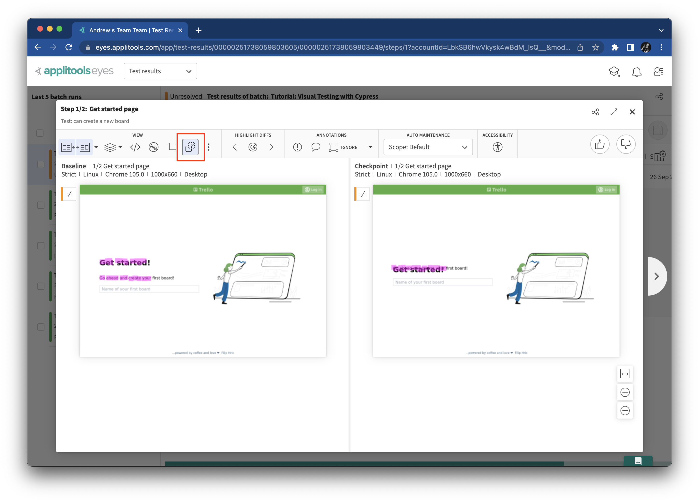

# Introducing visual changes

Things change.
It's what they do.
Some changes are intended as part of software development,
while others are bugs that ought to be fixed.
In this chapter, we'll learn how to handle both good and bad changes.


## Resetting app data

As we make changes to our Trello clone app, we will need to reset app data manually.
All data is stored in the `trelloapp-vue-vite-ts` project in the `backend/data/database.json`.
To reset data, simply replace all file contents with the following JSON:

```json
{
  "boards": [],
  "cards": [],
  "lists": [],
  "users": []
}
```

You can also manually inject data into the app through this file!


## Accepting a good change

Take another look at the get started page:


Let's change the nav bar's color from blue to green.
In the `trelloapp-vue-vite-ts` project,
open the `src/components/Navbar.vue` file,
and find these lines:

```
nav {
  @apply h-10 bg-blue7 grid grid-cols-3 z-10 fixed top-0 w-full;
}
```

Change `bg-blue7` to `bg-green7` like this:

```
nav {
  @apply h-10 bg-green7 grid grid-cols-3 z-10 fixed top-0 w-full;
}
```

Reset the app data, and reload the app in the browser.
You should now see a green nav bar instead of a blue one:


Switch back to the `visual-testing-with-cypress` project,
and rerun the test (`npx cypress open` or `npx cypress run`).
Open the Applitools Eyes dashboard to see the results:


This time, the results are marked as *Unresolved* in orange!
This is not necessarily a test failure.
It means that we, as human testers, must review the results to determine if it is a failure.
Both checkpoints report differences.
Open up the first one for a side-by-side comparison:


Applitools highlights visual differences in magenta.
The nav bar is highlighted on both the baseline and the checkpoint snapshots.

Since these changes are intentional,
let's accept these new checkpoint snapshots.
Click the thumbs-up button in the top-right corner of the comparison window:


Accept the change for the second snapshot as well.
Then, the results will be marked as *Passed*:


Any time you accept or reject snapshots,
make sure to save them so future tests can reference them
by clicking the save incon in the upper-right corner:


Now, whenver you run new tests, they will use the snapshot with the green banner as the baseline.
Rerun the test to verify:


## Discovering a bad change

With web frontends as complicated as they are these days,
it's all too easy to make a mistake.
Many times, visual bugs happen when we tweak layouts and styling.
Let's deliberately break the layout on the get started page.

In the `trelloapp-vue-vite-ts` project,
open the `src/components/Emptylist.vue` file,
and find these lines:

```html
<h1 class="mb-8 text-3xl font-bold">
  Get started!
</h1>
<p>Go ahead and create your first board!</p>
```

And change them to this:

```html
<div style="position: relative">
  <h1 class="text-3xl font-bold">
    Get started!
  </h1>
  <div style="position: absolute; top: 0; width: 100%">
    <p>Go ahead and create your first board!</p>
  </div>
</div>
```

The text will be the same, but the layout will make them overlap.
Reset the app data and reload the home page.
It should look like this:


That's clearly a visual bug!
Switch back to the `visual-testing-with-cypress` project,
rerun the test,
and check the results in the Applitools Eyes dashbard:


This time, the get started page has differences, while the new board page is unchanged.
Open the get started snapshot comparison window to see the differences:


## Analyzing the bug

It's clear to see that the text in the left column is different.
To see a clearer analysis of the differences,
click the button to hide differences caused by element displacement:



With this adjustment, Applitools Visual AI pinpoints the elements that actually changed:
the two text fields.
The input field for the new board name is no longer highlighted because it didn't change.
It merely shifted due to changes in other elements.

Let's do root cause analysis to understand the nature of the change.
In the toolbar under *View*, click "Root cause analysis".
To find differences in the page, click on the magenta regions in the snapshots.
For example, click the "Go ahead and create your first board!" text in the baseline snapshot.
The left sidebar will reveal the changes to the HTML and CSS:


The original element was a `p`, but it changed to a `div`.
Moreover, the new `div` gained new styling: `style: position:relative`.
Those changes are exactly what caused the visual bugs –
and exactly the code we injected to break the app.

Let's mark the bug we found.
Close the root cause analysis view.
In the toolbar under *Annotations*,
pick the circle with the exclamation point to add a bug region.
Set a bug region over the big in the checkpoint snapshot.
Name the bug "Overlapping text":


Click the *Create* button, and the snapshot will have the bug region!
Folks can come back and add comments to this bug region, too.

Our analysis is complete.
Reject the new snapshot by clicking thumbs-down:


Close the comparison window, and save the changes.
The test should now appear as failed:


Rerun the test again without changing the Trello clone app.
This time, it should fail automatically without any extra analysis.
Applitools will recognize that the checkpoint is the same as the previous failure:


Finally, let's fix this visual bug.
Undo the changes in the `trelloapp-vue-vite-ts` project to the `src/components/Emptylist.vue` file.
Revert this:

```html
<div style="position: relative">
  <h1 class="text-3xl font-bold">
    Get started!
  </h1>
  <div style="position: absolute; top: 0; width: 100%">
    <p>Go ahead and create your first board!</p>
  </div>
</div>
```

To this:

```html
<h1 class="mb-8 text-3xl font-bold">
  Get started!
</h1>
<p>Go ahead and create your first board!</p>
```

Relaunch the app, and rerun the Cypress test.
It should pass again:


Since the bug is now fixed, we should remove the bug region.
Open the comparison window for the get started snapshot,
click on the bug region,
and then delete it:


Save the changes.
The app is now back on track!