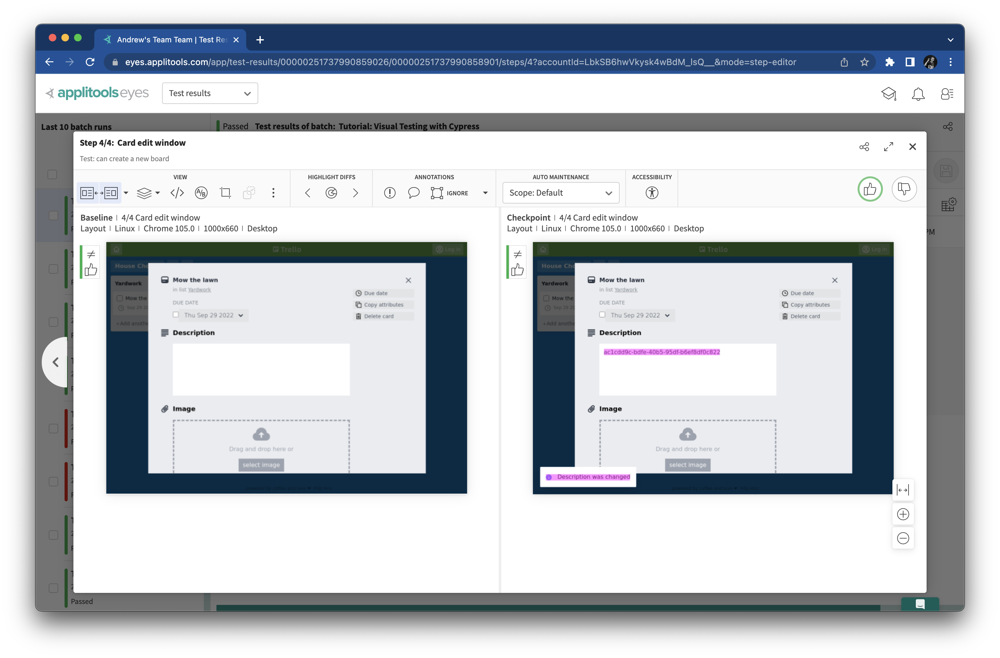

# Applying different match levels

Image matching is at the heart of Visual AI.
In most cases, the default or "strict" matching is good enough for tests,
but sometimes, we need to tune.
In this chapter, we will learn when and how to adjust the match level.


## Extending the test

Let's take our test further.
After creating a new board, let's create a new list and a new card.
Open `cypress/e2e/trello.cy.js`,
and add the following lines to the bottom of the `it('can create a new board'` test:

```javascript
// Add a new list
cy.get('[data-cy="add-list-input"]').type('Yardwork{enter}')

// Add a card to the list
cy.get('[data-cy="new-card"]').click()
cy.get('[data-cy="new-card-input"]').type('Mow the lawn{enter}')

// Verify the new list and card
cy.eyesCheckWindow('New list and card');

// Open the new card
cy.get('[data-cy="card"]').click()

// Verify the card edit window
cy.eyesCheckWindow('Card edit window');
```

These are typical Cypress calls with basic Applitools Eyes snapshots.
At the end of the test, the board should now look like this:


Run the updated test (`npx cypress run`) and check the Applitools Eyes dashboard.
Since this test now has two new snapshots, its result should be *Unresolved*:


Accept both new snapshots, and save the updates:


Great! Now our test covers more behavior.


## Ignoring a region

At first glance, our new snapshots look great.
Unfortunately, there's a problem lurking on the new card it adds – the date:


Whenever a new card is created, its due date is automatically set to two days in the future.
So, if I run this test on Sep 27, 2022, then the due date for this card will be Sep 29, 2022.
If I run this test a day later, then the due date will be different.
That means our baseline and checkpoint images will not match!

Thankfully, there's an easy fix:
we can set an [ignore region](https://help.applitools.com/hc/en-us/articles/360006915192-Adding-Ignorable-Regions)
over that date field.
Then, whenever this test runs again,
Applitools Visual AI will ignore any changes in that region.

Open the "New list and card" snapshot in the Applitools Eyes dashboard.
In the toolbar under *Annotations*,
click the "Ignore" button with the square icon,
and then draw a region box over the date field:


Close the comparison window, and save the changes.
Now, whenever you run a test, this region will be excluded from visual comparisons.
The test shouldn't fail depending on the date!


## Combining visual and traditional assertions

Ignoring the date field makes our visual assertion pass,
but we should still make sure that the date field has proper date formatting.
In this case, we will need to use a traditional assertion with a regular expression.
This isn't a problem.
In fact, it's a good thing:
we can make visual and traditional assertions work together to automate the best tests.

After these lines:

```javascript
// Verify the new list and card
cy.eyesCheckWindow('New list and card');
```

Add these lines:

```javascript
// Verify the card's due date
cy.get('[data-cy="due-date"] span')
    .invoke('text')
    .should('match', /[A-Z][a-z]+\s+\d\d?\s+\d{4}/)
```

Now, the date field isn't "ignored" – it's just covered by a traditional assertion.
Rerun the test to make sure everything passes.


## Selecting match levels

Ignore regions are not the only way to tune snapshots.
We can also apply different [match levels](https://help.applitools.com/hc/en-us/articles/360007188591-Match-Levels).
Applitools Eyes supports four different match levels:

1. The **exact** match level is a pixel-to-pixel comparison.
   It is not recommended for practical testing.
2. The **strict** match level compares everything visible to the human eye.
   It is the default match level, and it is recommended for most cases.
   So far, our test has used strict matching.
3. The **content** match level works similarly to *strict* except that it ignores colors.
4. The **layout** match level compares layouts while ignoring content, color, and style changes.

Our "Card edit window" snapshot would benefit from using the layout match level.
It has a date field and a description field that can have different values over time.

We could change the match level when viewing comparisons like this:


However, it would be better to set the match level in our automation code
so that it is automatically applied every time we run the test.

In `trello.cy.js`, change these lines:

```javascript
// Verify the card edit window
cy.eyesCheckWindow('Card edit window');
```

To these:

```javascript
// Verify the card edit window
cy.eyesCheckWindow({
  tag: 'Card edit window',
  target: 'window',
  fully: true,
  matchLevel: 'Layout',
});
```

Adding `matchLevel: 'Layout'` sets the match level to layout.
`Strict`, `Content`, and `Exact` are the other supported values.

Let's make sure this match level actually works.
Immediately above the code to verify the card edit window,
add the following lines to set random text in the description text area:

```javascript
// Add random text
var uuid = require("uuid")
var randomId = uuid.v4()
cy.get('[data-cy="card-description"]').type(randomId + '{enter}')
```

Every time you run the test, this text should be different.
The full test case method should now look like this:

```javascript
  it('can create a new board', () => {
    // Load the home page
    cy.visit('/')

    // Verify the home page loaded
    cy.eyesCheckWindow('Get started page');

    // Create a new board
    cy.get('[data-cy="first-board"]').type('House Chores{enter}')

    // Verify the new board is created
    cy.eyesCheckWindow({
      tag: 'New board page',
      target: 'window',
      fully: true
    });

    // Add a new list
    cy.get('[data-cy="add-list-input"]').type('Yardwork{enter}')

    // Add a card to the list
    cy.get('[data-cy="new-card"]').click()
    cy.get('[data-cy="new-card-input"]').type('Mow the lawn{enter}')

    // Verify the new list and card
    cy.eyesCheckWindow('New list and card');

    // Verify the card's due date
    cy.get('[data-cy="due-date"] span')
        .invoke('text')
        .should('match', /[A-Z][a-z]+\s+\d\d?\s+\d{4}/)

    // Open the new card
    cy.get('[data-cy="card"]').click()

    // Add random text
    var uuid = require("uuid")
    var randomId = uuid.v4()
    cy.get('[data-cy="card-description"]').type(randomId + '{enter}')

    // Verify the card edit window
    cy.eyesCheckWindow({
      tag: 'Card edit window',
      target: 'window',
      fully: true,
      matchLevel: 'Layout',
    });
  })
```

Run the test a few times to make sure it works.
The first time will yield an *Unresolved* result
because adding the text changes the page:



Subsequent runs should pass:


Ignore regions and match levels are powerful tools for tuning your visual assertions.
You can use them to check what matters and ignore what doesn't.
You can also add regions for matching levels instead of applying them to the whole snapshot!
