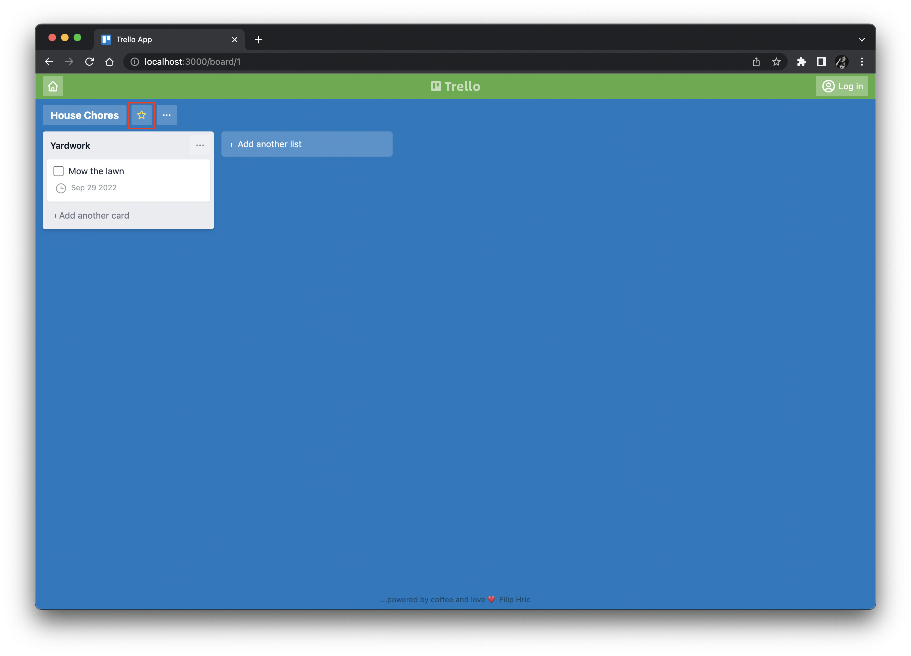
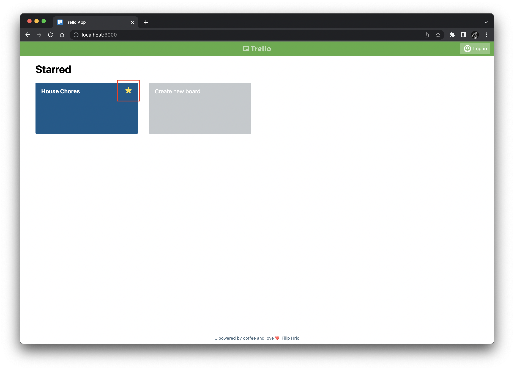
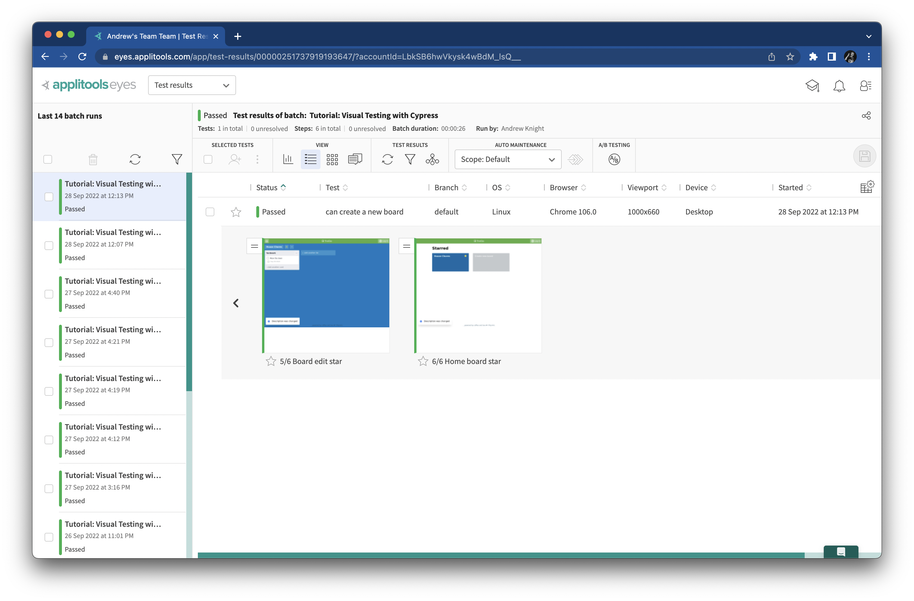
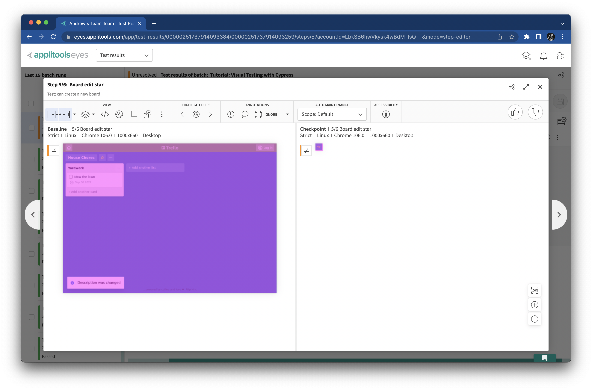
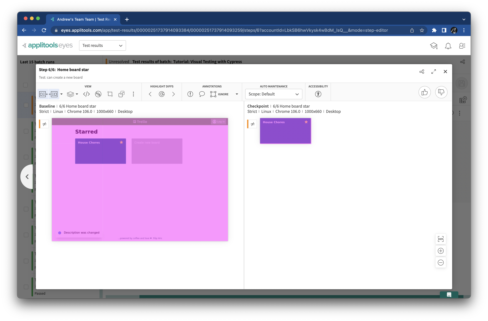
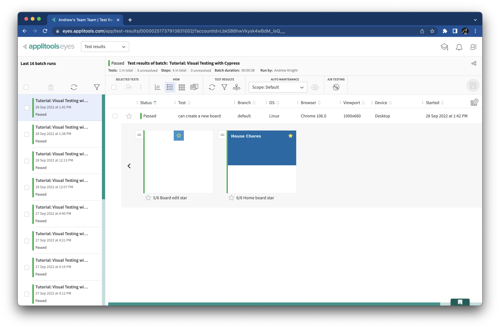

# Checking specific elements

In the last chapter, we learned how to refine how snapshots are matched.
That's not the only way to tune your snapshots.
In this chapter, we'll learn how to take snapshots of individual elements or regions of the page.

## Extending the test again

In the Trello clone app, we can mark boards as our favorites with a star.
On the board page, click the star button next to the board title button, and it will turn yellow:



If you click the home button to go to the home page and then hover over the board,
you'll see a solid yellow star in its upper-right corner:



This should be straightforward to automate.
You know what to do: add some Cypress interactions and Applitools verifications to our test.

Open `cypress/e2e/trello.cy.js`,
and add the following code to the bottom of the `it('can create a new board'` test:

```javascript
// Close the card edit window
cy.get('[data-cy="cancel"]').click()

// Mark the board with a star
cy.get('[data-cy="star"]').click()

// Verify the board is starred
cy.eyesCheckWindow({
  tag: 'Board edit star',
  target: 'window',
  fully: true,
  matchLevel: 'Layout',
});

// Navigate back to the home page
cy.get('[data-cy="home"]').click()

// Hover over the board
cy.get('[data-cy="board-item"]').trigger('mouseover')

// Verify the board shows a star when hovered
cy.eyesCheckWindow({
  tag: 'Home board star',
  target: 'window',
  fully: true,
});
```

This code follows the steps we just described.
The interactions are all clicks,
except the hovering wihch uses `trigger('mouseover')`.
We'll use a layout match level for checking the board edit star since that page has the due date.

Rerun the test (`npx cypress open` or `npx cypress run`).
Again, like in the last chapter, the new snapshots will be marked as *Unresolved* for their first run.
Take a look to make sure the yellow stars appear, and then accept and save the snapshots.
Run the test again to verify passing results:




## Narrowing snapshots from windows to elements

These new assertions grab the whole window,
but they only need to visually check the stars.
Checking the full window is a bit redundant.
We already have a full-window snapshot of the board edit page.
Plus, it can be difficult to spot the parts of the page that matter when capturing a whole window.

Thankfully, Applitools Eyes can narrow down snapshots to portions of a page and even individual elements.
We just need to tweak the way we call the snapshots.

Change these lines:

```javascript
// Verify the board is starred
cy.eyesCheckWindow({
  tag: 'Board edit star',
  target: 'window',
  fully: true,
  matchLevel: 'Layout',
});
```

With this:

```javascript
// Verify the board is starred
cy.eyesCheckWindow({
  tag: 'Board edit star',
  target: 'region',
  selector: '[data-cy="star"]',
});
```

Now, instead of targeting the full window, the snapshot targets a region given by the star element.
Make a similar change for the second assertion, too.
Change:

```javascript
// Verify the board shows a star when hovered
cy.eyesCheckWindow({
  tag: 'Home board star',
  target: 'window',
  fully: true,
});
```

To:

```javascript
// Verify the board shows a star when hovered
cy.eyesCheckWindow({
  tag: 'Home board star',
  target: 'region',
  selector: '[data-cy="board-item"]',
});
```

This snapshot will capture only the board element.

Rerun the test.
Since you changed the snapshots, the Applitools Eyes dashboard will report differences.
Make sure the snapshots look correct, and then accept the updates:





Save the changes, and run the test one more time to make sure everything is good:


