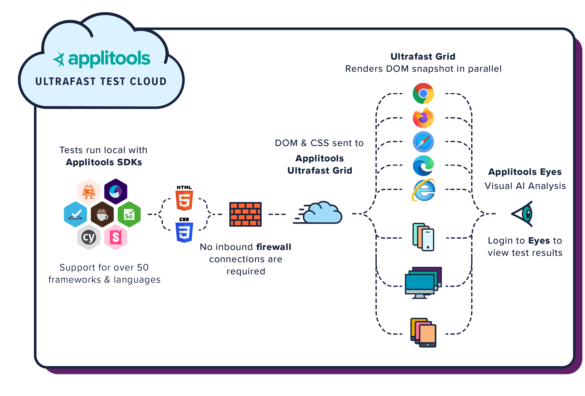
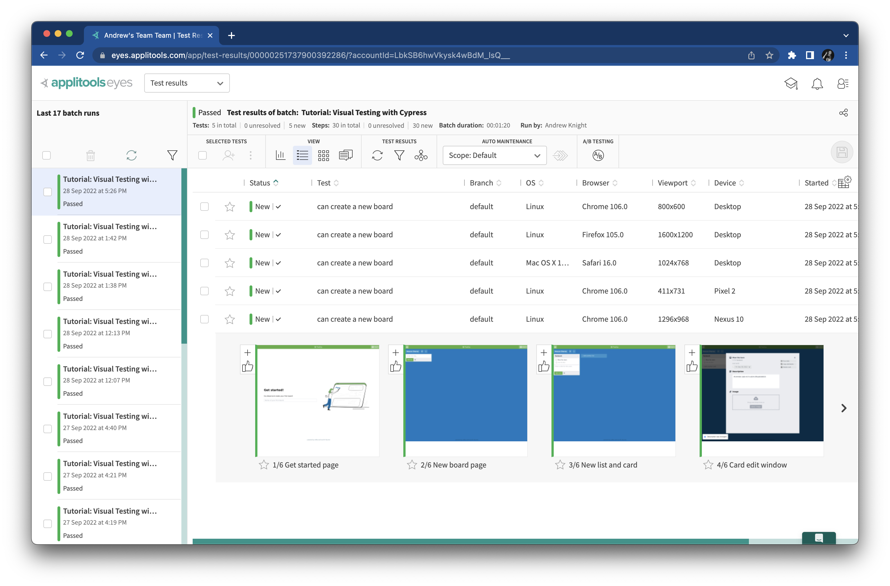

# Testing different browsers

So far, we have run all our tests against one browser.
Testing multiple browsers is vital for finding bugs
because each browser works slightly differently – especially for visuals.
In this chapter, we will configure our Cypress project for cross-browser testing.


## A new approach to cross-browser testing

Traditionally, cross-browser testing meant running a test from start to finish on different browser configurations.
For example, Cypress lets you pick the browser when running tests locally:


When running tests as part of a Continuous Integration system,
it is common to use a tool like [Selenium Grid](https://www.selenium.dev/documentation/grid/)
or a similar testing platform to run cross-browser tests at scale.

Unfortunately, traditional cross-browser testing has downsides:

* There are countless browser configurations to test.
  Browser type, browser version, operating system, viewport, and mobile device are all factors to consider.
* Tests must run in full against every browser configuration you choose to cover,
  which multiplies test execution time.
* You must either set up all the browser configurations yourself,
  or you must pay a vendor to do it for you.
  Either way, it has a high cost.
* Running tests from start to finish in a cloud-based platform makes individual tests slower.
  Anecdotally, tests run 2-4x slower than local runs.

Visual testing techniques offer a more modern approach to cross-browser testing.
When a visual test runs, it captures a *snapshot* of the view – not just a *screenshot*.
A screenshot is merely a rasterized capture of pixels:
it is an image file frozen in time.
A snapshot, however, captures everything on the page:
the HTML structure, the CSS styling, and the JavaScript that brings it to life.

When a test captures a snapshot, it can re-render that snapshot on any browser configuration.
Rendering snapshots and performing visual comparisons is much faster than running tests from start to finish.
To do this type of cross-browser testing,
we can use [Applitools Ultrafast Grid](https://applitools.com/platform/ultrafast-grid/).
For example, we can run our Cypress test locally on Chrome,
and then we can configure Applitools to run it against Safari or even a mobile browser in the Ultrafast Grid.
The test will run only one time locally,
but visual checkpoints will happen for each browser configuration in the cloud.
Tests also don't need to maintain back-and-forth network communication with the cloud:
snapshot upload is a one-time, one-way push.
Here's what it looks like:



*Note:*
You can also perform cross-platform testing for native mobile apps using
[Applitools Native Mobile Grid](https://applitools.com/platform/native-mobile-grid/)!

Let's update our Cypress test project to use Applitools Ultrafast Grid for cross-browser testing.


## Configuring Applitools to target multiple browsers

Your Cypress project needs only one change to use Applitools Ultrafast Grid.
Add the following browser settings to `applitools.config.js`:

```javascript
module.exports = {
  // ...
  browser: [
    {width: 800, height: 600, name: 'chrome'},
    {width: 1600, height: 1200, name: 'firefox'},
    {width: 1024, height: 768, name: 'safari'},
    {deviceName: 'Pixel 2', screenOrientation: 'portrait'},
    {deviceName: 'Nexus 10', screenOrientation: 'landscape'},
  ]
}
```

These lines will perform visual checkpoints on five different browsers.
The first three are desktop browsers (Chrome, Firefox Safari),
while the final two are mobile browsers.
You can run tests against any number of browsers.
You can also set viewport sizes for desktop browsers and screen orientations for mobile browsers.

These settings apply to the whole Cypress project.
You do *not* need to change the test case automation code to test different browsers!


## Running cross-browser tests

Rerun the test one time (`npx cypress open` or `npx cypress run`).
You can use any local browser.
Then, check the results in the Applitools Eyes dashboard:



Even though we ran the test only one time locally,
the latest batch has results for running the snapshots in the cloud on each browser we configured.
Open the different snapshots, and you will see how each looks different depending upon its browser.
Each result will be "new" because they represent new snapshots for newly-tested configurations.
